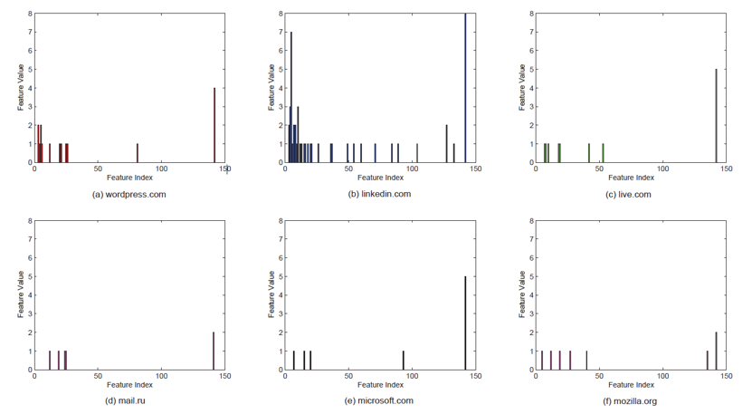
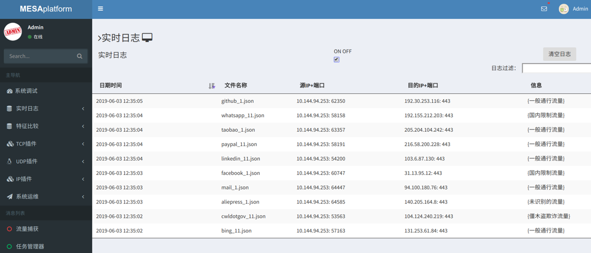

# traffic-analysis
基于流量数据的网络应用识别系统设计与实现

主要研究任务：
1. 研究基于加密网络流量的特征提取技术，实现面向IP的统计特征计算和输出，进行实现和评估。
2. 面向高速网络环境，研究基于机器学习算法的网络应用发现技术，至少提出1种识别算法，准确率不得低于90%。
3. 研发基于机器学习算法的网络应用识别系统。

利用思科软件joy 将pcap格式包转化为json格式，便于程序读取特征  
分析两种主要流特征<b>数据包长度分布、数据包到达间隔分布</b>，进行建模训练和展示  
<b>数据包长度分布 Packet_Length_Distribution:</b>  
记录会话的前100个分组包的大小。我们假设一个1500字节横坐标，并创建150个每个10字节的分组。 [0,10]范围内的任何数据包大小都将进入第一个分组，[10,20]范围内的任何数据包大小都将进入第二个分组，以此类推。我们获得了落入不同时间间隔的数据包数。最后，我们构造了一个长度为150的数组，表示数据包长度分布。  
  
如图显示了浏览不同网站时数据包长度的直方图分布。  
* linkedin.com的流量包含更多数据包，这些数据包落入更多不同的分组区间。  
* mail.ru的数据包较少，并且落入较少的分组区间。  
不同的网站其传输的数据包会有不同的长度大小信息。从图中我们可以看出其可能是一个明显的判别特征。  

<b>你可以点击display_video.mp4查看运行效果</b>  

