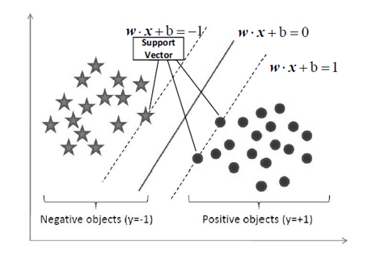

# traffic-analysis
基于流量数据的网络应用识别系统设计与实现

主要研究任务：
1. 研究基于加密网络流量的特征提取技术，实现面向IP的统计特征计算和输出，进行实现和评估。
2. 面向高速网络环境，研究基于机器学习算法的网络应用发现技术，至少提出1种识别算法，准确率不得低于90%。
3. 研发基于机器学习算法的网络应用识别系统。

# 特征提取
利用思科软件joy 将pcap格式包转化为json格式，便于程序读取特征  
分析两种主要流特征数据包长度分布、数据包到达间隔分布，进行建模训练和展示  
<b>（a）数据包长度分布 Packet_Length_Distribution:</b>  
记录会话的前100个分组包的大小。我们假设一个1500字节横坐标，并创建150个每个10字节的分组。 [0,10]范围内的任何数据包大小都将进入第一个分组，[10,20]范围内的任何数据包大小都将进入第二个分组，以此类推。我们获得了落入不同时间间隔的数据包数。最后，我们构造了一个长度为150的数组，表示数据包长度分布。  
  
如图显示了浏览不同网站时数据包长度的直方图分布。  
* linkedin.com的流量包含更多数据包，这些数据包落入更多不同的分组区间。  
* mail.ru的数据包较少，并且落入较少的分组区间。  
不同的网站其传输的数据包会有不同的长度大小信息。从图中我们可以看出其可能是一个明显的判别特征。  

<b>（b）数据包到达间隔分布	Packet Inter-arrival Time Distribution</b> 同理  
# 建模训练
首先我们需要将收集的网络流量数据类型分成四大类：  
(1) 一般通行网络流量：淘宝(taobao.com)、360(360.cn)、苹果(apple.com)等  
(2) 国内限制流量：脸书(facebook.com)、推特(twitter.com)、(youtube.com)等  
(3) 色情限制流量：(pornhub.com)等不再举例  
(4) 僵木盗欺诈流量：(uestc.icu) 等不再举例  
  
如上图所示：采用的是SVM分类器  
此外，在本项目中还实现了随机森林RandomForest、卷积神经网络CNN方法  
# 前端展示
采用的是Django框架。Django是一个免费、开源、高级的Python Web框架，采用MVT框架模式，能够最大化方便使用者的开发，使其专注于编写核心的应用程序，而不必被繁琐的框架模板等重复性工作所缠绕。

<b>您可以点击项目中的display_video.mp4查看运行效果</b> 

# 实验结论
综合两个重要的数据分析指标：
* 精确度(accuracy)
* 召回率(recall)

* 在实验中包括两种先进的算法用于比较，即SVM支持向量机，RF随机森林。结果表明，我们提出的SVM模型运行良好，优于其他竞争方法。而RF算法在此模型中表现不佳  
* 比较两种不同特征集上算法的结果，已经证明分组长度分布比分组到达间时间分布更具有辨别力!

